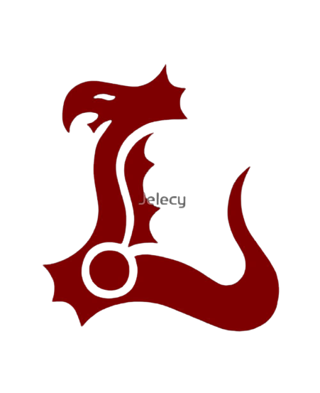

<p align="center">
  <a href="/">
    
  </a>
</p>
<p align="center">
  <a href="/">
    
  </a>
</p>
<p align="center">
  <a href="https://github.com/radhin123">
    
  </a>
</p>
<p align="center">
  <a href="https://github.com/radhin123?tab=followers">
    
  </a>
  <a href="https://github.com/radhin123/weabot-example/stargazers">
    
  </a>
  <a href="https://github.com/radhin123/Leviathan-Botzz/network/members">
    
  </a>
  <a href="https://github.com/radhin123/Leviathan-Botzz/watchers">
    
  </a>
  </a>
<a href="https://github.com/radhin123/Leviathan-Botzz/"></a>
<a href="https://hits.seeyoufarm.com"></a>
<a href="https://github.com/radhin123/Leviathan-Botzz/graphs/commit-activity"></a>&nbsp;&nbsp;
</p>
</p>

## Clone this project

```cmd
> git clone https://github.com/radhin123/Leviathan-Botzz
```

## Install the dependencies

```cmd
> npm install
> npm i
```

or:

```cmd
> yarn install
> yarn
```
<p align='center'>
    </p>

-------

## `ADD BUILDPACK`

```
> heroku/nodejs
> https://github.com/jonathanong/heroku-buildpack-ffmpeg-latest
> https://github.com/clhuang/heroku-buildpack-webp-binaries.git
```

## `CHANGE SESSION`

[`Click Here`](https://github.com/radhin123/Leviathan-Botzz/blob/master/session.json#L1)

## `SETTING`

- Owner number [Here](https://github.com/Leviathan-Botzz/Alphab0t12/blob/master/settings.json#L1)
- Owner name [Here](https://github.com/radhin223/Leviathan-Botzz/blob/master/settings.json#L1)
- Botname [Here](https://github.com/radhin123/Leviathan-Botzz/blob/master/settings.json#L1)
- 
## 'Usage'

```cmd
> npm start
```

Or :

```cmd
> yarn start
```

## Social Media

<p align="center">
<a href="https://www.instagram.com/only_fxc7" target="_blank"></a>
<a href="farhanxcode7@gmail.com" target="_blank"></a>
<a href="https://api.whatsapp.com/send?phone=628311800241&text=hmm" target="_blank"></a>
</p>

<p align="center">
  <a href="/">
    
  </a>
</p>
<p align="center">
  <a href="https://github.com/adiwajshing/baileys">
    
  </a>
</p>
<p align="center">
  <a href="https://github.com/ManuriosX">
    
</p>

## `THANKS TO`

- Allah SWT.
- My parents
- All Friends
- All Contributors
- All Creator Bot
